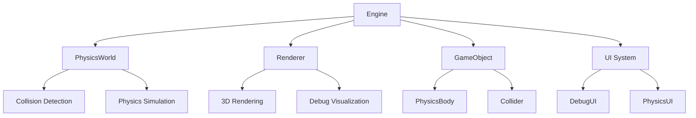
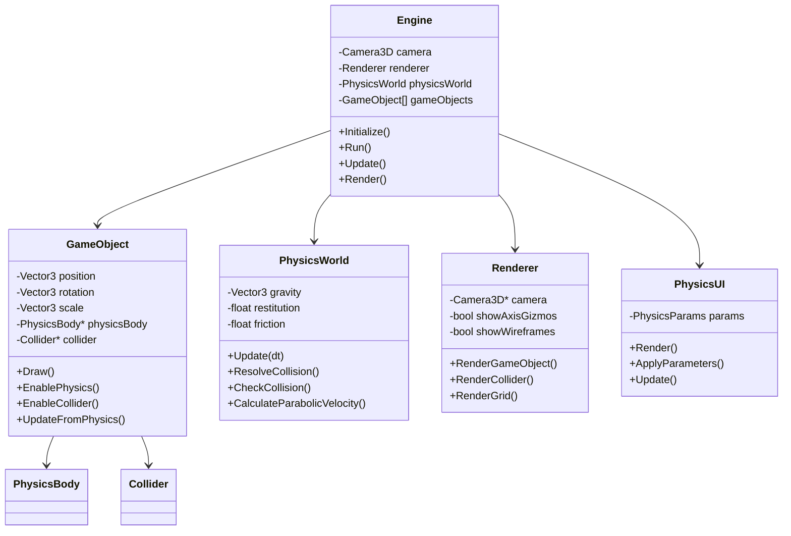
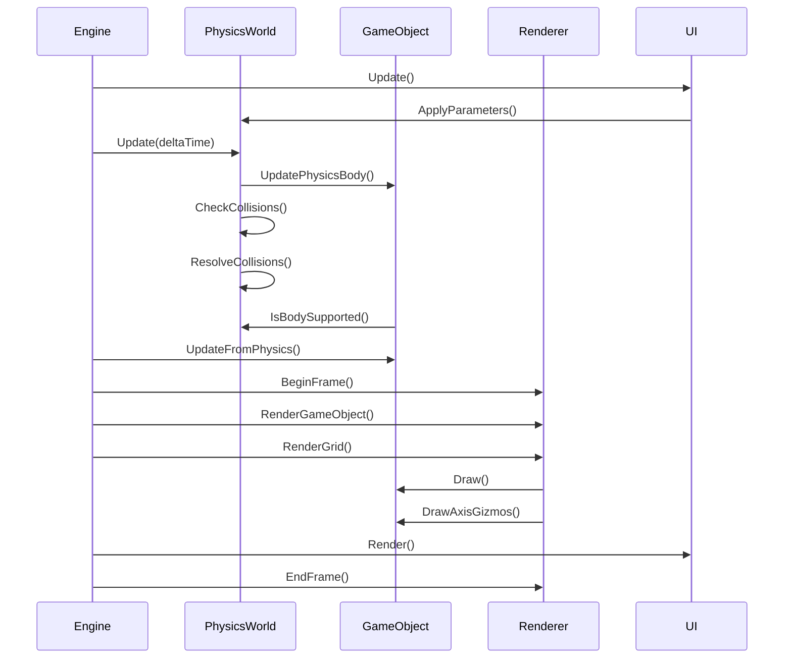

# Documentación del Motor de Física 3D


## Índice
1. [Introducción](#introducción)
2. [Arquitectura del Sistema](#arquitectura-del-sistema)
3. [Componentes Principales](#componentes-principales)
   - [Core](#core)
   - [Física](#física)
   - [Renderizado](#renderizado)
   - [UI](#ui)
4. [Flujo de Trabajo](#flujo-de-trabajo)
5. [Características Físicas](#características-físicas)
6. [Controles y Uso](#controles-y-uso)
7. [Extendiendo el Motor](#extendiendo-el-motor)

## Introducción

El Motor de Física 3D es una implementación de un sistema de simulación física para objetos tridimensionales, enfocado en la simulación de cuerpos rígidos (cubos) con detección y resolución precisa de colisiones. El motor está construido con C++ moderno (C++17) sobre la biblioteca Raylib para renderizado, ofreciendo una base sólida para experimentar con comportamientos físicos en un entorno 3D.

Principales características:
- Sistema de física completo con gravedad, fricción y rebote
- Detección de colisiones entre cubos y superficies
- Trayectoria parabólica y lanzamiento de objetos
- Panel de control para ajustar parámetros físicos en tiempo real
- Sistema de depuración visual con ejes de coordenadas y colisionadores

## Arquitectura del Sistema

El motor sigue una arquitectura modular con componentes claramente separados que interactúan entre sí:



Diagrama de clases simplificado:



## Componentes Principales

### Core

#### Engine
El núcleo del motor, responsable del bucle principal, la inicialización de todos los sistemas y su correcta interacción.

**Funcionalidades:**
- Inicialización del entorno 3D
- Gestión del bucle principal de actualización/renderizado
- Administración de los objetos del juego
- Coordinación entre física y renderizado

```cpp
Engine::Run() {
    while (running && !WindowShouldClose()) {
        Update();
        Render();
    }
}
```

#### GameObject
Representa un objeto 3D en el mundo con propiedades visuales y físicas.

**Funcionalidades:**
- Transformaciones (posición, rotación, escala)
- Integración con el sistema físico
- Representación visual
- Visualización de ejes de coordenadas (gizmos)

```cpp
void GameObject::EnablePhysics(float mass) {
    if (!hasPhysics) {
        physicsBody = new PhysicsBody(position, mass, colliderSize);
        hasPhysics = true;
    }
}
```

### Física

#### PhysicsWorld
Motor de física y simulación de fuerzas.

**Funcionalidades:**
- Simulación de gravedad
- Detección de colisiones AABB (caja contra caja)
- Resolución de colisiones con respuesta física
- Cálculo de trayectorias parabólicas
- Parámetros ajustables (fricción, rebote, etc.)

```cpp
void PhysicsWorld::UpdatePhysicsBody(PhysicsBody& body) {
    // Aplicar gravedad
    ApplyGravity(body);
    
    // Actualizar velocidad con aceleración
    body.velocity = Vector3Add(body.velocity, 
                     Vector3Scale(body.acceleration, deltaTime));
    
    // Actualizar posición con velocidad
    body.position = Vector3Add(body.position,
                     Vector3Scale(body.velocity, deltaTime));
                     
    // Resetear aceleración para próximo frame
    body.acceleration = {0.0f, 0.0f, 0.0f};
}
```

#### PhysicsBody
Representación física de un objeto con propiedades dinámicas.

**Propiedades:**
- Posición y velocidad
- Masa
- Estado de contacto con el suelo (isGrounded)
- Tamaño del colisionador

#### Collider
Volumen para detección de colisiones.

**Propiedades:**
- Posición
- Tamaño
- Indicador de estaticidad

### Renderizado

#### Renderer
Sistema de renderizado que gestiona la visualización 3D.

**Funcionalidades:**
- Renderizado de objetos 3D
- Visualización de wireframes y gizmos
- Renderizado de elementos de depuración
- Integración con la cámara

```cpp
void Renderer::RenderGameObject(const GameObject& obj) {
    obj.Draw();
    if (showWireframes) {
        obj.DrawWireframe();
    }
    if (showAxisGizmos) {
        obj.DrawAxisGizmos();
    }
}
```

### UI

#### DebugUI
Interfaz de usuario para depuración.

**Funcionalidades:**
- Mostrar información de objetos (posición, velocidad)
- Visualizar estadísticas del motor
- Panel activable con tecla F1

#### PhysicsUI
Interfaz para ajustar parámetros físicos en tiempo real.

**Funcionalidades:**
- Control de parámetros de gravedad
- Ajuste de fricción y rebote
- Control de parámetros de lanzamiento parabólico
- Previsualización de trayectoria
- Panel activable con tecla F2

```cpp
void PhysicsUI::ApplyParameters(PhysicsWorld& physicsWorld) {
    // Aplicar los parámetros al mundo físico
    physicsWorld.SetGravity(Vector3Scale(params.gravityDirection, 
                                        params.gravityMagnitude));
    physicsWorld.SetRestitution(params.restitution);
    physicsWorld.SetFriction(params.friction);
    physicsWorld.SetAirResistance(params.airResistance);
}
```

## Flujo de Trabajo

El flujo de ejecución del motor sigue estos pasos en cada frame:



## Características Físicas

### Sistema de Detección de Colisiones
El motor utiliza detección de colisiones AABB (Axis-Aligned Bounding Boxes) con las siguientes mejoras:

1. **Colisión de caja contra caja** - Detecta y resuelve colisiones entre objetos cúbicos
2. **Detección de soporte** - Verifica si un cuerpo está realmente apoyado sobre otro
3. **Histéresis para estado grounded** - Evita cambios rápidos en el estado de contacto con el suelo
4. **Umbrales de velocidad** - Elimina micro-movimientos para estabilizar objetos

### Fenómenos Físicos Implementados

#### Gravedad
Fuerza constante que actúa sobre los objetos, configurable en magnitud y dirección.

#### Fricción
Resistencia al movimiento cuando los objetos están en contacto.

#### Restitución (Rebote)
Coeficiente que determina la energía conservada en los impactos.

#### Resistencia del Aire
Amortiguación del movimiento con el tiempo.

#### Trayectoria Parabólica
Cálculo de velocidad inicial para lanzamiento en parábola:

```cpp
Vector3 PhysicsWorld::CalculateParabolicVelocity(float initialSpeed, 
                                              float angleDegrees, 
                                              bool applyToY) {
    float angleRadians = angleDegrees * DEG2RAD;
    Vector3 velocity = {0};
    
    if (applyToY) {
        velocity.y = initialSpeed * sinf(angleRadians);
        velocity.z = initialSpeed * cosf(angleRadians);
    } else {
        velocity.x = initialSpeed * sinf(angleRadians);
        velocity.z = initialSpeed * cosf(angleRadians);
    }
    
    return velocity;
}
```

## Controles y Uso

### Controles Básicos
- **WASD**: Mover el cubo blanco horizontalmente
- **Espacio**: Saltar con el cubo blanco
- **IJKL+UO**: Rotar el cubo blanco
- **ZX**: Escalar el cubo blanco (aumentar/reducir tamaño)
- **P**: Lanzar el cubo con parámetros de trayectoria parabólica
- **N**: Generar nuevo cubo en posición aleatoria
- **A**: Activar/desactivar visualización de ejes (gizmos)
- **F1**: Mostrar/ocultar panel de depuración
- **F2**: Mostrar/ocultar panel de parámetros físicos
- **ESC**: Salir

### Cámara
- **Q/E**: Orbitar cámara alrededor del cubo blanco
- **T/G**: Subir/bajar altura de cámara
- **C**: Cambiar color del cubo
- **R**: Resetear escena

### Interfaz PhysicsUI
- **Gravity**: Ajustar magnitud de la gravedad
- **Restitution**: Controlar rebote (0-1)
- **Friction**: Ajustar fricción de superficie (0-1)
- **Air Resistance**: Resistencia del aire (0.8-1)
- **Launch Velocity**: Velocidad inicial de lanzamiento
- **Launch Angle**: Ángulo de lanzamiento en grados

## Extendiendo el Motor

### Añadir Nuevos Objetos
Para agregar nuevas formas más allá de los cubos:

1. Extender la clase `GameObject` con especializaciones
2. Implementar nuevas formas de colisión en `PhysicsWorld`
3. Añadir métodos de renderizado específicos

### Implementar Nuevos Fenómenos Físicos
Para añadir nuevos comportamientos físicos:

1. Añadir parámetros relevantes en `PhysicsWorld`
2. Implementar la lógica de simulación en los métodos de actualización
3. Añadir controles en `PhysicsUI` para los nuevos parámetros

### Optimizaciones Potenciales
- Implementar estructuras espaciales (octrees, grid espacial) para detección de colisiones
- Añadir paralelismo para actualización de múltiples objetos
- Implementar sistema de reposo para objetos estáticos
